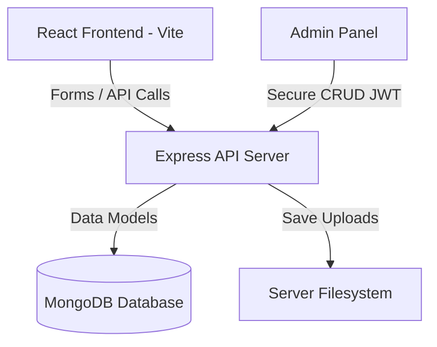

# VelvetVows - MERN Wedding Planner Platform

An elegant, premium, MERN-stack wedding planner website named **VelvetVows**, crafted to look exactly like the high-end boutique design of `lalalali.in`. 

While the original site was a static client-only app that mocked database modifications and form entries using `localStorage`, **VelvetVows implements a fully-realized MERN backend**. Image uploads, sangeet/services details, YouTube video embeds, and client contact enquiries are stored in a MongoDB database with files kept safely on the server filesystem.

---

## 🏗️ Architecture & Features



### 1. Database Schema (MongoDB & Mongoose)
- **User (Admin):** Username and password (pre-save hook hashes password with `bcryptjs`).
- **Item (Image Assets):** Standardizes slider configurations. Tracks `type` (`hero` | `gallery` | `services`), label, and unique reference path.
- **Video:** Saves the YouTube highlights embed URL.
- **Enquiry:** Captures contact submissions (`name`, `email`, `phone`, `subject`, `message`, and timestamp).

### 2. File Upload & Base64 Decoder
When the administrator publishes new images to the Hero Slider or Gallery via drag-and-drop:
1. The client reads files as base64 data URLs.
2. The payload is sent to `/api/items`.
3. The backend detects base64 headers, decodes the raw buffer, writes a physical file (e.g. `img-1718123456.jpg`) under `/uploads`, and saves the static path in the MongoDB document.
4. Relative image URLs are mapped correctly on the client side, bypassing database bloat and the 5MB `localStorage` limit.

### 3. JWT Security & Protected Operations
All administrative modifications (`POST`, `PUT`, `DELETE` on items and videos, and reading enquiries) are protected via a Bearer token verification middleware.

---

## 📂 Project Structure

```
velvet-vows/
├── package.json             # Monorepo root config
├── backend/                 # Express, Node & MongoDB API
│   ├── config/              # DB connection handler
│   ├── middleware/          # JWT auth guards
│   ├── models/              # Mongoose schemas
│   ├── routes/              # API endpoints
│   ├── uploads/             # Server file store
│   ├── .env                 # Database & JWT port configuration
│   └── server.js            # Main server entrypoint (seeds initial data)
└── frontend/                # React (Vite) Single Page App
    ├── index.html           # Font preconnects & description
    ├── src/
    │   ├── context/         # Admin public fetch & auth contexts
    │   ├── components/      # Navbar, Footer
    │   ├── pages/           # Home, About, Services, Contact, Admin
    │   ├── index.css        # Premium HSL variables and transitions
    │   └── main.jsx         # App bootstrapping
```

---

## ⚡ How to Run

### Prerequisite
Ensure you have **Node.js** and a local instance of **MongoDB** running (defaulting to `mongodb://127.0.0.1:27017`).

### 1. Install all dependencies
In the root directory, run the following command to automatically install packages for both frontend and backend:
```bash
npm run install-all
```

### 2. Start in Development Mode
Launch both the Vite dev server (port 5173) and the Express server (port 5000) concurrently using:
```bash
npm run dev
```

The database will be automatically seeded on startup with default images, YouTube URL highlights, and the admin account:
*   **Default Username:** `admin`
*   **Default Password:** `lalalali2024`

---

## 🔐 API Reference

### Authentication
- `POST /api/auth/login` - Public sign-in. Returns token.
- `GET /api/auth/me` - Private user info.

### Content Management
- `GET /api/items?type=hero|gallery|services` - Get images.
- `POST /api/items` - Private. Add new images (decodes base64 buffer).
- `PUT /api/items/:id/label` - Private. Edit image title.
- `DELETE /api/items/:id` - Private. Delete image (also removes file from disk).
- `DELETE /api/items?type=` - Private. Clear collection list.

### YouTube Highlights
- `GET /api/video` - Get YouTube highlight URL.
- `POST /api/video` - Private. Save new YouTube URL.

### Enquiries (Contact Submissions)
- `POST /api/enquiries` - Public. Submit contact form entry.
- `GET /api/enquiries` - Private. List all inquiries.
- `DELETE /api/enquiries/:id` - Private. Delete enquiry.
# VelvetVows
